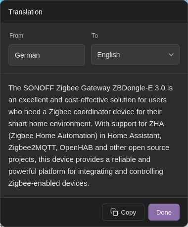

# LangPeek

A cross-browser extension for Firefox and Chrome that translates selected text when you middle-click (press the scroll wheel). Features auto-detection of source language and a beautiful, theme-adaptive UI.



## Features

- 🖱️ **Middle-click to translate** - Simply select text and middle-click to see the translation
- 🌍 **Auto language detection** - Automatically detects the source language
- 🎨 **Theme adaptive** - Follows your system's light/dark theme
- 🔄 **Change target language on-the-fly** - Switch between languages directly in the tooltip
- 📋 **One-click copy** - Copy translations to clipboard instantly
- ⚙️ **Customizable** - Set your default target language in preferences

## Installation

### For Development/Testing

**Firefox:**

1. Open Firefox and navigate to `about:debugging`
2. Click **"This Firefox"** in the left sidebar
3. Click **"Load Temporary Add-on..."**
4. Navigate to this directory and select `manifest.json`

**Chrome:**

1. Open Chrome and navigate to `chrome://extensions/`
2. Enable **"Developer mode"** (toggle in top right)
3. Click **"Load unpacked"**
4. Select this directory

### For Production

1. Package the extension:
   ```bash
   cd langpeek
   zip -r langpeek.zip * -x "*.git*" -x "README.md" -x "screenshots/*"
   ```
2. Submit to:
   - [Firefox Add-ons](https://addons.mozilla.org/developers/)
   - [Chrome Web Store](https://chrome.google.com/webstore/devconsole/)

## Usage

1. **Select text** on any webpage
2. **Middle-click** (press the scroll wheel) on the selection
3. View the translation in the popup tooltip
4. Change target language using the "To" dropdown if needed
5. Click **Copy** to copy the translation to clipboard
6. Click **Done** or click outside to close

## Configuration

### Setting Default Target Language

1. Right-click the extension icon → **"Manage Extension"** → **"Preferences"**
2. Or navigate to `about:addons` → find "LangPeek" → **"Preferences"**
3. Select your preferred target language from the dropdown
4. Settings are saved automatically and synced across devices

## Supported Languages

English, Spanish, French, German, Italian, Portuguese, Russian, Japanese, Korean, Chinese (Simplified & Traditional), Arabic, Hindi, Dutch, Polish, Turkish, Vietnamese, Thai, Swedish, Danish, Finnish, Norwegian, Czech, Greek, Hebrew, Hungarian, Indonesian, Malay, Romanian, Ukrainian, Bulgarian, Catalan, Croatian, Slovak, Slovenian, Serbian, Lithuanian, Latvian, Estonian

## Technical Details

- **Manifest Version**: 3
- **Translation API**: Google Translate (free tier)
- **Storage**: Uses `browser.storage.sync` for settings
- **Permissions**: `storage`, `activeTab`, and access to Google Translate API

## Files Structure

```
langpeek/
├── manifest.json        # Extension manifest (MV3)
├── background.js        # Background script for API calls
├── content.js           # Content script for UI and interaction
├── styles.css           # Tooltip and UI styles
├── options.html         # Preferences page UI
├── options.js           # Preferences page logic
├── options.css          # Preferences page styles
└── icons/               # Extension icons (16, 48, 128px)
    ├── icon-16.svg
    ├── icon-48.svg
    └── icon-128.svg
```

## Browser Compatibility

- **Firefox**: 140.0 or higher (required for data_collection_permissions support)
- **Chrome**: 93.0 or higher (Chromium-based browsers)
- **Edge**: 93.0 or higher (Chromium-based)
- **Manifest**: V3
- **Cross-browser**: Uses WebExtension Polyfill for compatibility

## Privacy

- No data is collected or stored by this extension
- Text is sent to Google Translate API only when you trigger a translation
- Your language preferences are stored locally in your browser

## Cross-Browser Implementation

This extension uses the [WebExtension Polyfill](https://github.com/mozilla/webextension-polyfill) for Firefox compatibility:

- **Background Scripts**: Uses `scripts` array (Firefox MV3 format)
- **Promise-based APIs**: Consistent Promise-based `browser.*` API
- **No Build Process**: Works directly without compilation
- **Security**: All innerHTML assignments properly sanitized to prevent XSS

### Implementation Details

The manifest uses Firefox's MV3 background scripts configuration:

```json
"background": {
  "scripts": ["browser-polyfill.min.js", "background.js"]
}
```

- **Firefox**: Native support for MV3 background scripts
- **Security**: All dynamic content properly escaped with `escapeHtml()` function
- **DOM manipulation**: Uses safe methods (createElement, textContent) where possible

### Files Structure with Polyfill

```
langpeek/
├── browser-polyfill.min.js  # WebExtension Polyfill (~10KB)
├── manifest.json            # Cross-browser compatible manifest
├── background.js            # Background script (polyfill loaded via manifest)
├── content.js               # Content script (polyfill loaded via manifest)
├── options.html             # Options page (polyfill loaded via script tag)
└── ...
```

## License

MIT License - Feel free to modify and distribute

## Troubleshooting

**Translation doesn't appear:**

- Open the Browser Console (Ctrl+Shift+J) to see any errors
- Make sure you have an internet connection
- Reload the extension from `about:debugging`

**Middle-click triggers autoscroll:**

- The extension should prevent this, but ensure the text is properly selected before clicking

**Languages not changing:**

- Check the Browser Console for errors
- Reload the webpage and try again

## Contributing

Contributions are welcome! Feel free to submit issues or pull requests.
